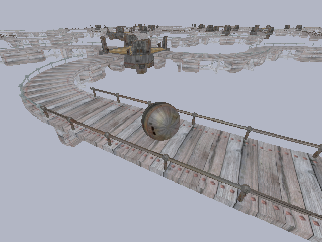

# Mazes
Sverchok Blender code for 2D and 3D maze generation

References
*  [elfnor's blog posts](http://elfnor.com/blender-maze-generator.html)  
*  [James Buck's blog](http://weblog.jamisbuck.org/2011/2/7/maze-generation-algorithm-recap) and book "Mazes for Programmers".  
*  [Sami Salkosuo's gist](https://gist.github.com/samisalkosuo/77bd95f605fc41dc7366)  
